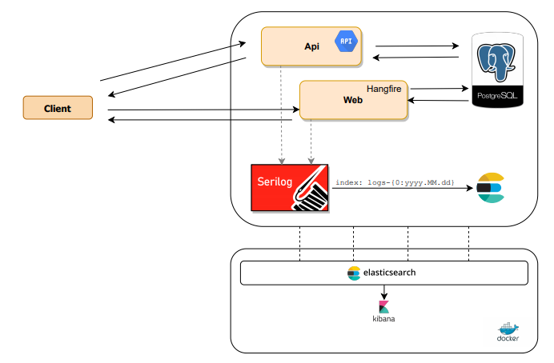

EnerjiSA.GenerationService.sln is using n-tier architecture written in .NET 5.0 SDK. 

## Technologies & Tools

* ASP.Net 5.0
* ASP.NET Core Web API
* Entity Framework Core 5.0
* PostgreSQL
* Docker - Docker Compose
* Serilog
* Elasticsearch
* Kibana
* Xunit, FluentAssertions


| Concept | Description |
| --- | --- |
| Docker | It was implemented to help us make a faster and reliable deployment. |


## Prerequities

You will need the following tools:

* [Visual Studio Code or 2019](https://www.visualstudio.com/downloads/) 
* [.Net 5.0 SDK](https://dotnet.microsoft.com/download/dotnet/5.0)
* [Docker](https://www.docker.com/)
* [Docker Compose](https://docs.docker.com/compose/)

## Setup Production Mode
* If you use windows operation system run-prod-up.bat or run the command:
``` 
docker-compose -f docker-compose-prod.yml up -d --force-recreate --build
``` 

* All infrastructure to up and running. (generation-api, postgres, elasticsearch and kibana)

## Setup Debug Mode
* If you use windows operation system run `run-dev-up.bat` or run the command:
``` 
docker-compose -f docker-compose-dev.yml up -d --force-recreate
``` 

* All infrastructure to up and running. (generation-api, postgres, elasticsearch and kibana)

* Open `EnerjiSA.GenerationService.sln` file with vs2019

* Go to the Solution Explorer, right-click on 'EnerjiSA.GenerationService.sln' and select the option “Set StartUp Projects…“

* Choose the `EnerjiSA.GenerationService.API` and `EnerjiSA.GenerationService.Web` to startup projects.

* Run the application.

## Services

| Service           | Url                               | Description                           |
|-------------------|-----------------------------------|-------------------------------------- |
| Web Api           | http://localhost:5000/swagger     | Only development mode                 |
| Web UI            | http://localhost:5001/            |                                       |
| Web UI (Hangfire) | http://localhost:5001/hangfire    | Only development mode                 |
| PostgreSQL        | http://localhost:5432             |                                       |
| Pgadmin           | http://localhost:5050             | email:'admin@admin.com', pwd:'admin'  |
| Elastic search    | http://localhost:9201             |                                       |
| Kibana            | http://localhost:5602             |                                       |


## Topology

